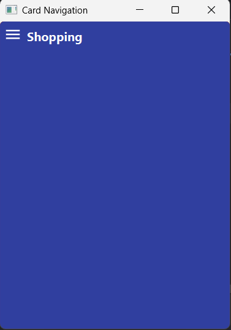
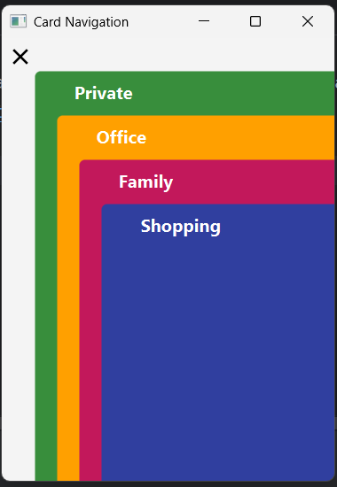
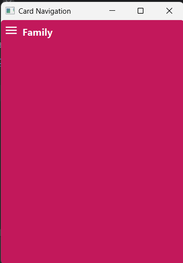

# cardnav
A little JavaFX based card navigation demo, I updated the code to run with Java 21, you can try other JDKs. original repo
[here](https://github.com/HanSolo/cardnav)

# Demo
You can run this app using `./gradlew run` from a unix like terminal, or from intellij Idea from the gradle menu executing
the "application/run" task

