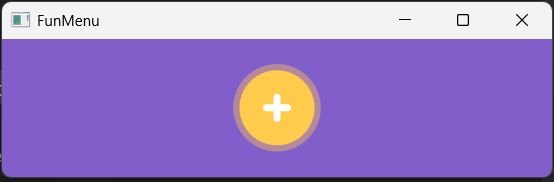

# funmenu
A little JavaFX based menu component, I adapted the code to run with Java21. Original repo [here](https://github.com/HanSolo/funmenu)

# Demo
Run using intellij in the gradle menu using the "application/run" task and or from a unix like terminal `./gradlew run` 

