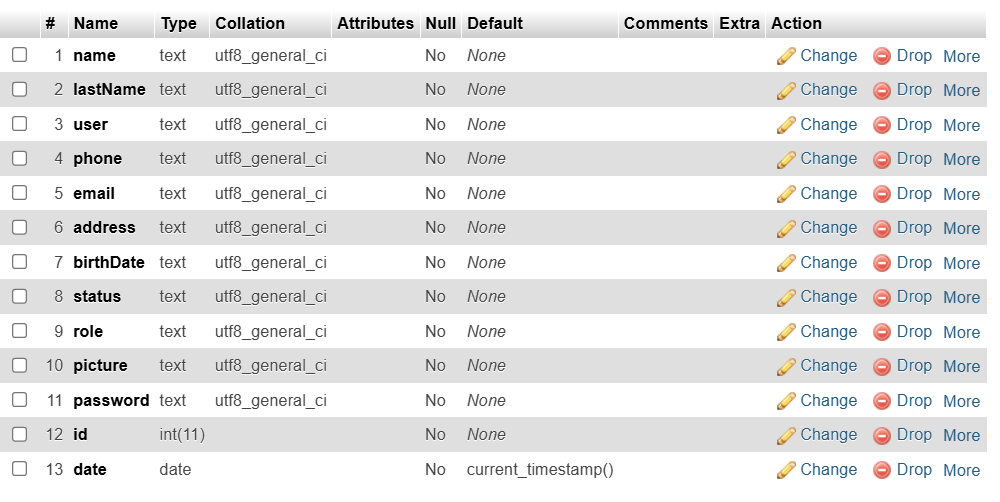
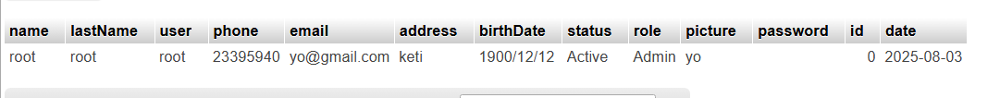

# iLite MySql JavaFx Sales System
# Attention!
Im publishing this old project cuz few guys where asking me on youtube. There are many bugs and  I also lost the sql file, but if you are smart you can create it by 
analyzing the code in the package "com.inv.xflux.entity", and the project is not completed, many features are missing, so feel free to code some.

# Building
Just open the project with Intellij and use "gradlew.bat jpackage -PinstallerType=msi" to create Window executable.
Note: You must have the wix toolset installed and jdk14+ installed and added to the Path.

For mac just use "./gradlew jpackage -PinstallerType=pkg"

For linux use "./gradlew jpackage -PinstallerType=deb" or rpm

Check tutorial setup video [here](https://www.youtube.com/watch?v=nmzt0OBAKuw), Important in my case I had to make sure 
not to install in "program files" directory, I installed in in `AppData/Local/XAMPP`, I created the last directory in this URL 

From the tutorial there is a few things you need to do differently if its is your fist time installing this program, 
select all the same options as in the tutorial but add also `phpmyadmin`, once everything is installed, close the program 
and open it again but as an administrator, and select the "X" on `Apache` and `MySQL`, this will install the services, then 
click on Apache's "Config" button, select `<Browse> phpMyAdmin`, this basically opens the directory where you installed 
XAMPP and opens the directory "phpMyAdmin", open the file called `config.inc.php`, here you can change things like the port 
MySQL server is listening on but basically and without changing anything in this file leaves you with the following configuration
to connect to the DB from the application
```
db server = localhost
db port = 3306
db name = ilite
db user = root
```

Now you can follow the rest of the tutorial about creating a DB, however since there is no DDL script we can use to start
the DB as in the tutorial you'd have to at least create the `employe` table with the following schema 


Then insert the following values in the `Insert` tab that is available when you select the db, in this case called `ilte`


Now you can log in to the app using the user `root` with no password. It an next iteration it would be good to create the
DDL script to create all tables required in this DB for this business model but I have to go through all the models in the
package `package com.inv.xflux.model;`, for example the `EmployeeModel` class has a method called `getAll` here you can get
the right table names you should use

# FINAL NOTE
I will not be fixing or updating this project, so use it as your own discretion.

