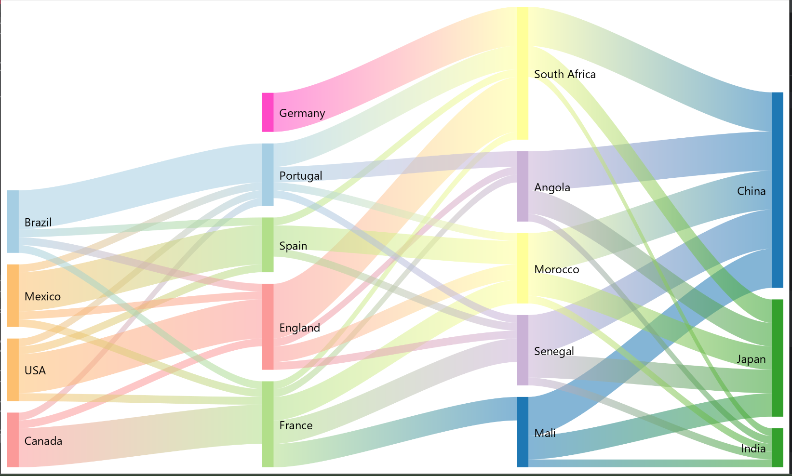

## Sankey Plot
A JavaFX implementation of a sankey plot, This is a version of the original code [here](https://github.com/HanSolo/sankeyplot), 
This project was adapted and can be run with `./graldew run` from a unix like terminal or from IntelliJ Idea using the
gradle menu on the right and running the `run` gradle task

# Screenshot

